# 東方永夜抄　～ Imperishable Night

<picture>
  <source media="(prefers-color-scheme: dark)" srcset="resources/progress_dark.svg">
  
</picture>

> **当前 RunEcl (0x4184b0) 字节匹配进度：71.89%** — 184/184 opcode 全部实现，帧布局对齐至 /Od 匿名临时下限（帧 0x600 vs 原版 0x5c4，余 15 槽为编译器匿名临时无法绑定）。ECL 变量系统 4 getter 99%+，EclLerp/ComputeSinCos 100%。

[![Discord][discord-badge]][discord] <- click here to join discord server.

[discord]: https://discord.gg/VyGwAjrh9a
[discord-badge]: https://img.shields.io/discord/1147558514840064030?color=%237289DA&logo=discord&logoColor=%23FFFFFF

This project aims to perfectly reconstruct the source code of [Touhou Eiyashou ~ Imperishable Night 1.00d](https://en.touhouwiki.net/wiki/Imperishable_Night) by Team Shanghai Alice.

**This project is still highly work in progress and in its early stages.**


## Installation

### Executable

This project requires the original `th08.exe` version 1.00d (SHA256 hashsum 330fbdbf58a710829d65277b4f312cfbb38d5448b3df523e79350b879213d924, you can check hashsum on windows with command `certutil -hashfile <path-to-your-file> SHA256`.)

Copy `th08.exe` to `resources/`.

### Dependencies

The build system has the following package requirements:

- `python3` >= 3.4
- `msiextract` (On linux/macos only)
- `wine` (on linux/macos only, prefer CrossOver on macOS to avoid possible CL.EXE heap issues)
- `aria2c` (optional, allows for torrent downloads, will automatically install on Windows if selected.)

The rest of the build system is constructed out of Visual Studio 2002 and DirectX 8.0 from the Web Archive.

#### Configure devenv

This will download and install compiler, libraries, and other tools.

If you are on windows, and for some reason want to download dependencies manually,
run this command to get the list of files to download:

```
python scripts/create_devenv.py scripts/dls scripts/prefix --no-download
```

But if you want everything to be downloaded automatically, run it like this instead:

```
python scripts/create_devenv.py scripts/dls scripts/prefix
```

And if you want to use torrent to download those dependencies, use this:

```
python scripts/create_devenv.py scripts/dls scripts/prefix --torrent
```

On linux and mac, run the following script:
```bash
# NOTE: On macOS if you use CrossOver.
# export WINE=<CrossOverPath>/wine
./scripts/create_th08_prefix
```

#### Building

Run the following script:

```
python3 ./scripts/build.py
```

This will automatically generate a ninja build script `build.ninja`, and run
ninja on it.

### Diffing

In order to contribute to the decompilation, you are going to need reccmp
([Instructions](https://github.com/isledecomp/reccmp/tree/master?tab=readme-ov-file#getting-started)).

In the project root, run:

```bash
reccmp-project detect --search-path resources/
```

Build the recompiled executable if you have not done so (see
the above section). Then, in the `build/` directory, run:

```bash
reccmp-project detect --what recompiled
```

To generate a report of the differences between the original and recompiled
binaries, again in the `build/` directory, run:

```bash
reccmp-reccmp --target th08 --html report.html
```

This will display a report of the accuracy to the original binary, and export
this report to a HTML file `report.html`.

# Credits

We would like to extend our thanks to the following individuals for their
invaluable contributions:

- @EstexNT for porting the [`var_order` pragma](scripts/pragma_var_order.cpp) to
  MSVC7.

---

# 更新日志 (Changelog)

见 [CHANGES.md](CHANGES.md)。

# 中文版

# 東方永夜抄　～ Imperishable Night

<picture>
  <source media="(prefers-color-scheme: dark)" srcset="resources/progress_dark.svg">
  
</picture>

[![Discord][discord-badge]][discord]

[discord]: https://discord.gg/VyGwAjrh9a
[discord-badge]: https://img.shields.io/discord/1147558514840064030?color=%237289DA&logo=discord&logoColor=%23FFFFFF

本项目旨在完美重建 [東方永夜抄　～ Imperishable Night 1.00d](https://en.touhouwiki.net/wiki/Imperishable_Night)（上海爱丽丝幻乐团）的源代码。

**注意：本项目仍处于高度进行中的早期阶段。**

## 安装

### 可执行文件

本反编译项目需要原版 `th08.exe` 1.00d 版本
（SHA256 校验值 `330fbdbf58a710829d65277b4f312cfbb38d5448b3df523e79350b879213d924`，
在 Windows 下可用 `certutil -hashfile <文件路径> SHA256` 校验）。

将 `th08.exe` 复制到 `resources/` 目录。

### 依赖

构建系统需要以下软件包：

- `python3` >= 3.4
- `msiextract`（仅 Linux/macOS）
- `wine`（仅 Linux/macOS，macOS 建议用 CrossOver 以避免 CL.EXE 堆问题）
- `aria2c`（可选，支持 torrent 下载，Windows 下如需会自动安装）

构建系统的其余部分由 Visual Studio 2002 与 DirectX 8.0（来自 Web Archive）构成。

#### 配置开发环境（devenv）

该步骤会下载并安装编译器、库和其他工具。

如果你在 Windows 上想手动下载依赖，运行以下命令获取下载清单：

```
python scripts/create_devenv.py scripts/dls scripts/prefix --no-download
```

如果想自动下载所有内容，直接运行：

```
python scripts/create_devenv.py scripts/dls scripts/prefix
```

如果想使用 torrent 下载依赖，加 `--torrent` 参数：

```
python scripts/create_devenv.py scripts/dls scripts/prefix --torrent
```

在 Linux 和 macOS 上，运行以下脚本：

```bash
# 注意：macOS 上如果使用 CrossOver
# export WINE=<CrossOverPath>/wine
./scripts/create_th08_prefix
```

#### 构建

运行以下脚本：

```
python3 ./scripts/build.py
```

这会自动生成 ninja 构建脚本 `build.ninja` 并执行它。

### 比对（Diffing）

参与反编译需要使用 reccmp（[使用说明](https://github.com/isledecomp/reccmp/tree/master?tab=readme-ov-file#getting-started)）。

在项目根目录运行：

```bash
reccmp-project detect --search-path resources/
```

如果你还没编译重编译可执行文件（见上文），先编译。然后在 `build/` 目录运行：

```bash
reccmp-project detect --what recompiled
```

要生成原版与重编译二进制之间的差异报告，同样在 `build/` 目录运行：

```bash
reccmp-reccmp --target th08 --html report.html
```

这会显示与原始二进制的一致性报告，并导出为 HTML 文件 `report.html`。

# 致谢

我们衷心感谢以下贡献者：

- @EstexNT 将 [`var_order` pragma](scripts/pragma_var_order.cpp) 移植到了
  MSVC7。